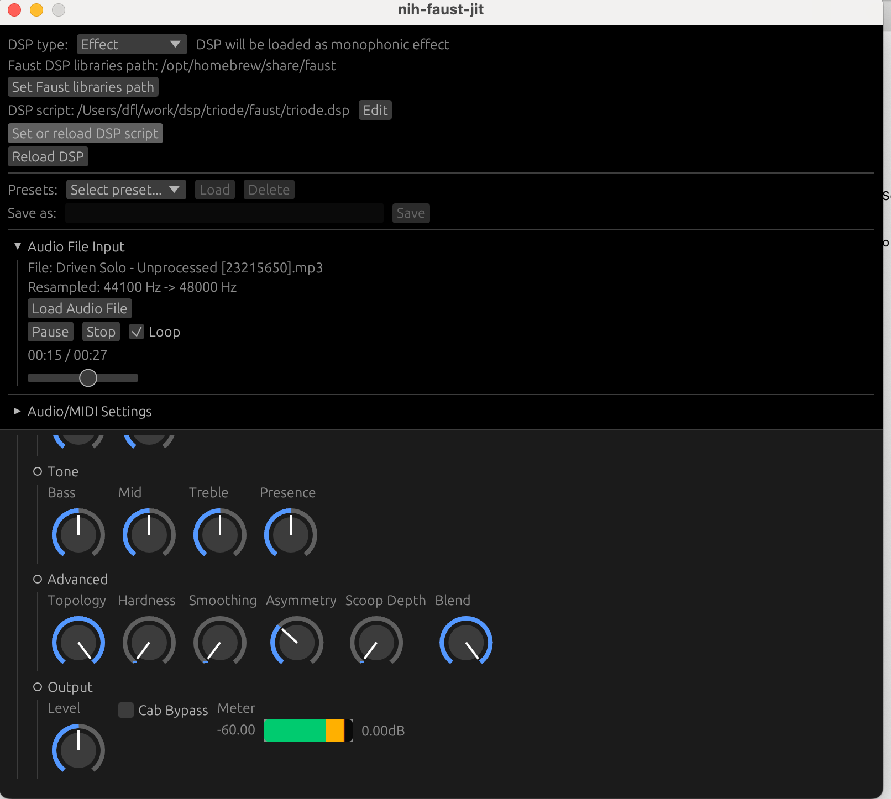

[](https://garnix.io/repo/YPares/nih-faust-jit)

# nih-faust-jit

A plugin to load Faust dsp files and JIT-compile them with LLVM. Limited to
stereo audio (DSP scripts with more than 2 input/ouput chans will be refused).
The selected DSP script is saved as part of the plugin state and therefore is
saved with your DAW project. A two-part GUI is provided:

- Select which script to load and where to look for the Faust libraries that
this script may import
- Tweak the parameters described in the script (shown as various `egui` widgets)

Both effect and instrument DSPs are supported, with MIDI notes and CCs in both
cases. The DSP script type is normally detected from its metadata. E.g. if the
script contains a line like:

`declare options "[midi:on][nvoices:12]";`

then the script will be considered to be an instrument with `12` voices of
polyphony. But you can override this via the GUI to force the DSP script type
and number of voices: this is notably useful for scripts that describe
instruments but do not contain a `[nvoices:xxx]` metadata.

## UI



### Widget Features

- DSP widgets are shown in a two-directional scrollable panel (you can also
  left-click on empty space and drag to pan around)
- `v`/`h`/`tgroup`s are implemented as foldable containers
- Widget styles: sliders, knobs (286° arc with vertical drag), and LED displays
- Log/exp scale support for sliders and bargraphs (automatic log scaling for dB units)
- Meter state machine: bargraphs display green/orange/red colors with clip hold
- Shift-drag for fine control (0.1x sensitivity)
- Hover any widget to see its current value in a tooltip
- Double-click on any slider/knob label to reset it to its default value

### Parameter Management

- Parameters are saved with your DAW project (plugin mode only)
- Use `[order:N]` metadata in your DSP script to control parameter ordering in the GUI
- Preset system: save, load, and delete presets per DSP script
- "Edit DSP" button opens the current DSP file in your system's default editor

### Playback Control (when audio file is loaded)

- Space bar toggles audio playback

## Building

First install [Rust](https://rustup.rs/) and [Faust](https://faust.grame.fr/downloads/).

### Quick Start

The default configuration in `.cargo/config.toml` is set up for **macOS with Homebrew**. If you've installed Faust via `brew install faust`, you can build immediately:

```shell
cargo run --release
```

For other platforms, edit `.cargo/config.toml` and uncomment the appropriate section for your platform (Windows or Ubuntu), then run `cargo clean` before building.

### Environment Variables

Faust paths are configured through environment variables at build time:

- `FAUST_LIB`: which library to link with. Use `"faust"` for dynamic linking (macOS/Linux) or `"static=libfaustwithllvm"` for static linking (Windows)
- `FAUST_LIB_PATH`: path to the Faust library directory
- `FAUST_HEADERS_PATH`: path to the Faust C/C++ headers
- `DSP_LIBS_PATH`: default path to [Faust DSP libraries](https://faustlibraries.grame.fr/) (can be overridden at runtime via GUI)
- `LLVM_CACHE_FOLDER`: path to cache LLVM bytecode for faster reloads (can be empty to disable)

Platform-specific defaults are provided in `.cargo/config.toml`. After changing these values, run `cargo clean` to ensure they take effect.

### Building Plugins

To compile and package the VST3 and CLAP plugins:

```shell
cargo xtask bundle nih_faust_jit --release
```

### Running the Standalone

Running the standalone version of the plugin is just:

```shell
cargo run --release
```

You can optionally provide a path to a Faust DSP script and an audio file for testing via command-line arguments:

```shell
# Load a specific DSP script on startup
cargo run --release -- /path/to/my_effect.dsp

# Load both a DSP script and an audio file for testing/playback
cargo run --release -- /path/to/my_effect.dsp /path/to/test_loop.wav

# Use with other nih-plug flags (e.g. debug mode and setting jack buffer size)
cargo run --release -- --debug /path/to/my_effect.dsp -p 1024
```

When a DSP script is provided via the command line, it will override any previously saved session state. If an audio file is provided, it will automatically start playing in a loop upon startup.

On Windows, if you are getting an error like:

```
thread 'cpal_wasapi_out' panicked at 'Received 1056 samples, while the configured buffer size is 512'
```

when using the standalone exe with the default WASAPI audio backend, it means
you should set the buffer size with:

```shell
cargo run --release -- -p 1056
```

### Bluetooth Audio

Bluetooth audio devices don't work unless the sample rate is set to 44.1kHz:

```shell
cargo run --release -- --sample-rate 44100
```

You can also set this in the UI under "Audio/MIDI Settings" and save it for future sessions.

## Installing via the Nix flake

`nih_faust_jit` is also packaged with Nix. If you are not using NixOS, running the plugin (standalone or not)
requires your Nix installation to be able to run OpenGL applications, which requires an extra bit of setup.
You can use [nix-system-graphics](https://github.com/soupglasses/nix-system-graphics) for that effect.

Then, running the standalone exe of the plugin is:

```shell
nix run
```

and building and packaging the VST3 & CLAP plugins and the standalone exe is:

```shell
nix build
```

which will create a `./result` symlink with two folders, `plugin` and `bin`.

Re. the standalone version, if you are using a Linux distribution with Pipewire (such as Ubuntu), prefer using the `nih_faust_jit_pipewire` output,
which wraps `nih_faust_jit_standalone` so it can use either the ALSA or Jack backend via Pipewire (JACK by default).

## Known shortcomings

- Scripts are reloaded only when clicking on the `Set or reload DSP script`
  button. Therefore, anytime you modify something in the top panel (ie. things
  related to how the DSP should be loaded), don't forget to manually reload the
  script (just re-select the same file in the file picker).
- Volume can get high quickly when using polyphonic DSPs, because Faust voices
  are just summed together. The plugin exposes a Gain parameter to the host.
  Don't forget to use it if your instrument script doesn't perform some volume
  reduction already.
- Keyboard input is not supported (you cannot directly type a value in numeric entry).
  This comes from [a bug in baseview](https://github.com/RustAudio/baseview/issues/152).

## Faust features not yet supported

- Soundfiles

## Crates

The main crate containing the plugin is `nih_faust_jit`. Parts of its logic are
exposed as lower-level crates, that could be reused in other projects:

**`faust_jit`** defines the `SingletonDsp` type. It wraps the part of the
`libfaust` API that is needed to:

- load an effect or instrument DSP from a script,
- process audio buffers with it,
- extract the information needed to build a GUI that can tweak the DSP's
  internal parameters (represented as the `DspWidget` type).
  
`faust_jit` is related to [rust-faust](https://github.com/Frando/rust-faust),
but `rust-faust` deals only with static compilation of DSP scripts to Rust code.
The `faust_jit` crate is not limited to stereo DSP scripts (only the plugin is).

**`faust_jit_egui`** draws an `egui` GUI from the `DspWidget`s.
